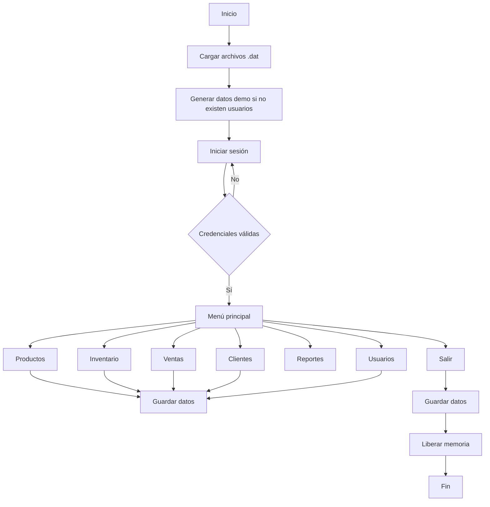

# 🛒 POLI POS — Tech Store
Sistema de punto de venta desarrollado en **C** para administrar una tienda de productos tecnológicos.

El programa permite gestionar usuarios, productos, clientes, inventario, ventas, facturas y reportes de caja mediante estructuras, listas enlazadas, punteros, memoria dinámica, archivos binarios, recursividad y Quicksort.

---

## 📌 Descripción

**POLI POS** es una aplicación de consola creada como proyecto académico de Programación en C. Su objetivo es simular el funcionamiento básico de un punto de venta para una tienda tecnológica.

El sistema está dividido en funciones especializadas para facilitar la lectura, reutilización y mantenimiento del código.

---

## ✨ Funcionalidades

### 👤 Gestión de usuarios

- Inicio de sesión con usuario y contraseña.
- Manejo de tres roles:
  - **Administrador**
  - **Supervisor**
  - **Vendedor**
- Restricción de opciones según el rol.
- Creación dinámica de nuevos usuarios.

### 📦 Productos e inventario

- Registro de productos.
- Validación de identificadores duplicados.
- Búsqueda por ID o por nombre.
- Actualización de stock.
- Cambio global del porcentaje de IVA.
- Consulta general del inventario.

### 🧾 Ventas y facturación

- Validación del cliente antes de facturar.
- Validación del formato de fecha `DD/MM/AAAA`.
- Verificación de stock disponible.
- Cálculo automático de subtotal, IVA y total final.
- Actualización del inventario después de cada venta.
- Generación de una factura en formato `.txt`.

### 👥 Clientes

- Registro de clientes.
- Validación de cédulas de 10 dígitos.
- Prevención de clientes duplicados.
- Acumulación del valor total comprado.

### 📊 Reportes

- Ranking de clientes mediante **Quicksort**.
- Cierre de caja semanal.
- Cierre de caja mensual.
- Cierre de caja anual.
- Cálculo de cierres mediante funciones recursivas.

### 💾 Persistencia de datos

La información se almacena en archivos binarios:

```text
productos.dat
clientes.dat
ventas.dat
usuarios.dat
```

Al iniciar el sistema, estos archivos son leídos para reconstruir las listas enlazadas.

---

## 🧠 Conceptos de C utilizados

| Concepto | Aplicación en el proyecto |
|---|---|
| `struct` | Representación de usuarios, productos, clientes y ventas |
| Punteros | Recorrido y modificación de listas enlazadas |
| Doble puntero | Inserción de nodos y modificación de la cabeza de una lista |
| `malloc()` | Reserva dinámica de memoria |
| `free()` | Liberación de memoria antes de finalizar |
| Archivos | Guardado y carga de información |
| Recursividad | Cálculo de cierres de caja |
| Quicksort | Ordenamiento del ranking de clientes |
| Cadenas | Usuarios, contraseñas, nombres, fechas y cédulas |
| Validaciones | Control de los datos ingresados por el usuario |

---

## 🏗️ Flujo general del sistema



---

## 📂 Estructuras principales

### `Usuario`

```c
typedef struct Usuario {
    char user[20];
    char pass[20];
    int rol;
    struct Usuario* sig;
} Usuario;
```

Representa las credenciales, el rol y el enlace al siguiente usuario.

### `Producto`

```c
typedef struct Producto {
    int id;
    char nombre[MAX_NOM];
    float precio;
    int stock;
    int iva;
    struct Producto* sig;
} Producto;
```

Guarda la información de cada producto y su posición dentro de la lista enlazada.

### `Cliente`

```c
typedef struct Cliente {
    char cedula[MAX_CED];
    char nombre[MAX_NOM];
    float totalComprado;
    struct Cliente* sig;
} Cliente;
```

Almacena los datos del cliente y el total histórico de sus compras.

### `Venta`

```c
typedef struct Venta {
    int id;
    char fecha[15];
    char cedulaCli[MAX_CED];
    float subtotal;
    float totalIva;
    float totalFinal;
    struct Venta* sig;
} Venta;
```

Registra la información principal de una factura.

---

## 🧩 Módulos del programa

```text
main()
├── cargarDatos()
├── datosDemo()
├── login()
├── crearProducto()
├── menuInventario()
├── menuVentas()
├── menuReportes()
├── menuUsuarios()
├── guardarDatos()
└── limpiarMemoria()
```

---

## 🔐 Roles y permisos

| Opción | Administrador | Supervisor | Vendedor |
|---|:---:|:---:|:---:|
| Crear productos | ✅ | ✅ | ❌ |
| Gestionar inventario | ✅ | ✅ | ❌ |
| Registrar ventas | ✅ | ✅ | ✅ |
| Registrar clientes | ✅ | ✅ | ❌ |
| Consultar reportes | ✅ | ✅ | ❌ |
| Crear usuarios | ✅ | ✅ | ❌ |
| Elegir cualquier rol nuevo | ✅ | ❌ | ❌ |

> El supervisor puede crear usuarios, pero el sistema les asigna automáticamente el rol de vendedor.

---

## 🚀 Requisitos

- Compilador compatible con C.
- Windows, debido al uso de `system("cls")` y `system("pause")`.
- GCC, MinGW o un IDE como:
  - Code::Blocks;
  - Dev-C++;
  - Visual Studio Code con GCC.

---

## ⚙️ Compilación

Con GCC:

```bash
gcc main.c -o poli_pos
```

Ejecución en Windows:

```bash
poli_pos.exe
```

Compilación con advertencias activadas:

```bash
gcc -Wall -Wextra main.c -o poli_pos
```

---

## 🔑 Usuarios de demostración

Cuando no existe un archivo previo de usuarios, el sistema crea automáticamente:

| Usuario | Contraseña | Rol |
|---|---|---|
| `admin` | `123` | Administrador |
| `vende` | `123` | Vendedor |

También se generan clientes y productos de prueba para facilitar la demostración.

---

## 🧪 Flujo de uso recomendado

1. Iniciar sesión.
2. Crear o revisar productos.
3. Registrar un cliente.
4. Abrir la opción de caja.
5. Ingresar la cédula del cliente.
6. Registrar número y fecha de factura.
7. Buscar productos y elegir cantidades.
8. Finalizar la venta.
9. Revisar la factura `.txt`.
10. Consultar el ranking o el cierre de caja.

---

## 🧾 Ejemplo de factura generada

```text
=== POLI POS ===
Factura: 1001 | Fecha: 14/07/2026
Cliente: Juan Perez
--------------------
1x Laptop Gamer Gigabyte - $1200.00
2x Mouse Inalambrico Logitech - $50.00
--------------------
SUBTOTAL: $1250.00
TOTAL IVA: $187.50
TOTAL FINAL: $1437.50
```

El nombre del archivo sigue el formato:

```text
Factura_<numero>.txt
```

---

## 🔄 Recursividad en los cierres

Las funciones de cierre recorren la lista de ventas nodo por nodo:

```c
float sumaAnual(Venta* n, int anioBuscado);
float sumaMensual(Venta* n, int mesBuscado, int anioBuscado);
float sumaSemanal(Venta* n, int semBuscada, int mesBuscado, int anioBuscado);
```

Cada función tiene:

- un **caso base**, cuando el nodo es `NULL`;
- una llamada recursiva al siguiente nodo;
- una condición para sumar únicamente las ventas del período solicitado.

---

## 🏆 Ranking de clientes

El ranking convierte temporalmente la lista enlazada en un arreglo de punteros y lo ordena mediante **Quicksort**.

El criterio de ordenamiento es:

```text
Mayor total comprado → menor total comprado
```

De esta manera, los mejores clientes aparecen en las primeras posiciones.

---

